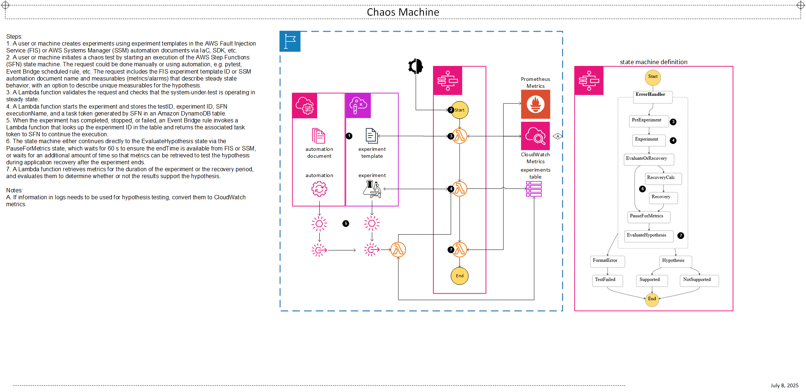
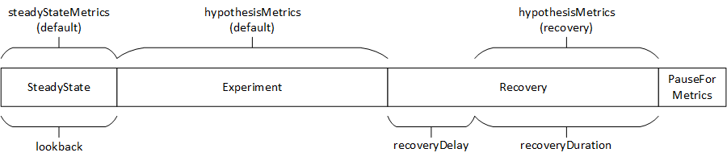

# Chaos Machine
Chaos Machine is a complete chaos engineering workflow that enables customers to run controlled chaos experiments and test hypotheses related to system behavior. Chaos Machine uses metric and alarm data from both [Amazon CloudWatch](https://aws.amazon.com/cloudwatch/) and [Prometheus](https://prometheus.io/) as inputs to evaluate system behavior before, during, and after the experiment. The Chaos Machine provides a simple, consistent way to organize and execute chaos experiments, and is appropriate to use for both building and conducting ad-hoc experiments or integrating into more sophisticated automation pipelines. Chaos Machine can use [AWS Fault Injection Service](https://docs.aws.amazon.com/fis/) (FIS) or [AWS Systems Manager](https://aws.amazon.com/systems-manager/) (SSM) to run controlled experiments, and [AWS Step Functions](https://aws.amazon.com/step-functions/) and [AWS Lambda](https://aws.amazon.com/lambda/) for orchestration and execution.

## Architecture


## Usage
* Review the architecture diagram above to understand how the Chaos Machine works, then see the [`examples`](examples) directory for working examples to reference. I recommend copying an example to a separate deployment directory outside of the project repo.
* Create the `chaos-machine` Lambda layer before deploying the stack. This layer also includes the JSON schema for validation, so the layer must be updated whenever the schema is updated. This must be done from the project directory and requires Python 3.11 is available on the local machine.
```bash
make venv
make layer/package
```
* Deploy the stack from the deployment directory.
```bash
terraform apply
```

```hcl
provider "aws" {
  region = local.region
}

locals {
  region      = "us-west-2"
  project_env = "dev"
}

module "chaos-machine" {
  source = "/home/ec2-user/repos/chaos-machine"

  create_iam_roles = true
  project_env      = local.project_env

}
```

### Chaos machine input and execution
Each execution of the Chaos Machine runs an experiment and tests a hypothesis. Input for the execution is defined by a [JSON schema](_docs/schemas/chaos-machine-input.json); see the example [inputs](examples/inputs/) for reference. The execution input includes two sets of measurables: `steadyState` and `hypothesis`. If you're new to chaos engineering and aren't familiar with these terms, I recommend reviewing the ["Test resiliency using chaos engineering"](https://docs.aws.amazon.com/wellarchitected/latest/reliability-pillar/rel_testing_resiliency_failure_injection_resiliency.html) best practice in the reliability pillar of the AWS Well-Architected Framework, guidance in [Principles of Chaos Engineering](https://principlesofchaos.org/), and [Chaos Engineering Stories](https://chaosengineeringstories.com/). In most cases, the hypothesis will be that the system will continue to behave in steady state during and after the chaos experiment. If this is the case, specify`"hypothesis": "steadyState"`. However, the Chaos Machine allows you to specify unique measurables for `hypothesis`. This is particularly useful for evaluating disaster recovery or analyzing specific metrics that may not be part of a well-defined steady state.

When defining the metrics and expressions to be used for the `steadyState` and `hypothesis`, I recommend starting by using the [Amazon CloudWatch](https://aws.amazon.com/cloudwatch/) Metrics console to create and test example metrics and expressions with the system to be tested, and then using the **Source** tab to view and copy the definitions to the execution input file. You can also use this same approach to create CloudWatch alarms by creating a metric for the alarm, then clicking on the bell icon under **Actions** in the **Graphed metrics** tab to create the alarm. One of the key features of the chaos machine is that it uses the powerful built-in capabilities of both CloudWatch and Prometheus to evaluate the metric data, rather than having to handle that in the application logic. Thus, you're able to take full advantage of both of these tools to build almost unlimited evaluation expressions. If you use Prometheus for your application monitoring, see the [Prometheus](#prometheus) section for details.

A test begins when you start an execution of the state machine. During the **SteadyState** step, a Lambda function will retrieve the measurables defined in `steadyState` for the amount of time specified in the `lookback` to verify that the system has been behaving normally. If the evaluation passes, i.e. the application is in "steady state", the experiment will be started. No measurables are checked during the experiment. Once the experiment is completed, by default, the hypothesis is tested based on data retrieved for the period between the experiment start time and end time. However, if you wish to test your hypothesis during application recovery *after* the experiment ended, you can use `recoveryDelay` and `recoveryDuration` in the execution input so that metric/alarm data will be retrieved for the period starting `recoveryDelay` seconds after the experiment end time and ending `recoveryDuration` seconds later.



### Experiment templates
The Chaos Machine can run experiments defined as FIS experiment templates or SSM automation documents, but does not create either. You must create the experiment using one of these formats before beginning the steps below. I recommend using FIS with its built-in actions and scenarios to create experiments whenever possible, including using the `aws:ssm:start-automation-execution` action for custom experiments that you may create using SSM automation documents. However, if you do not have access to FIS, you can create an experiment using SSM automation documents and the Chaos Machine will execute these directly, without FIS. These documents can be reused if/when you get access to FIS. If you have access to FIS in another Region, you can reference the SSM command documents, which are different than automation documents, that the service provides for experiments run on EC2 instances; the names of these documents all start with `AWSFIS`. When including these as part of FIS experiments, as originally intended, you use the `aws:ssm:send-command` action to run them. To use one of these command documents (or another) with Chaos Machine, you can create an automation document that includes a step with the [`aws:runCommand`](https://docs.aws.amazon.com/systems-manager/latest/userguide/automation-action-runcommand.html) action and specifies the command document name. See the [FIS User Guide](https://docs.aws.amazon.com/fis/latest/userguide/what-is.html), [Chaos Engineering Workshop](https://catalog.workshops.aws/fis-v2/en-US), [SSM User Guide](https://docs.aws.amazon.com/systems-manager/latest/userguide/systems-manager-automation.html), and [Systems Manager Automation runbook reference](https://docs.aws.amazon.com/systems-manager-automation-runbooks/latest/userguide/automation-runbook-reference.html) for details.

## Examples
The [`examples`](examples) are intended to provide users references for how to use the module(s), as well as testing/validating changes to the source code of the module. If contributing to the project, please be sure to make any appropriate updates to the relevant examples to allow maintainers to test your changes and to keep the examples up to date for users. Thank you!
* [Complete](examples/complete/). This example will deploy the chaos machine and required IAM resources.
* [Prometheus](examples/prometheus/). This modifies the `complete` example to enable using Prometheus metrics. See the [Prometheus](#prometheus) section for details.
* [Experiments](examples/experiments/). This includes example experiments using both FIS and SSM.
* [Inputs](examples/inputs/). This includes example [execution inputs](#execution-inputs).
* [Tests](examples/tests/). This includes example [tests](#pytest).

### Execution inputs
To help you get familiar with using the Chaos Machine in a realistic scenario, this project includes example execution inputs and automation (using the `pytest` framework) to run an experiment for the PetAdoptions application that is part of the [Chaos Engineering Workshop](https://catalog.workshops.aws/fis-v2/en-US). You can follow the instructions in the [Bring your own AWS Account](https://catalog.workshops.aws/fis-v2/en-US/environment/bring-your-own) section of the workshop website. Then you can create the [AZ Disruption](https://catalog.workshops.aws/fis-v2/en-US/workshop/005network/510az) experiment from the workshop, simulate [user activity](https://catalog.workshops.aws/fis-v2/en-US/environment/user-simulation/), and try running tests based on the example [inputs](examples/inputs/). There's an example Terraform deployment for the AZ disruption experiment in the [`examples`](examples/experiments/az_disruption/az_disruption.tf).
* Example chaos test [execution inputs](examples/inputs/):
  * [PetSiteAZDisruption-split.json](examples/inputs/PetSiteAZDisruption-split.json): This example is configured to use CloudWatch *metrics* and specifies *unique* definitions for the `steadyState` and `hypothesis`.
  * [PetSiteAZDisruption-same.json](examples/inputs/PetSiteAZDisruption-same.json): This example is configured to use CloudWatch *metrics* and *reuses* the definitions in `steadyState` for `hypothesis`.
  * [PetSiteAZDisruption-alarms.json](examples/inputs/PetSiteAZDisruption-alarms.json): This example uses only CloudWatch *alarms* and reuses the definitions in `steadyState` for `hypothesis`.
    * To create an alarm used in this example, follow the instructions in the **AZ Disruption** page under **Understand steady-state** to get to the dashboard, click on the options for the `OK (2xx)` widget, choose **View in metrics**, and click on the bell icon under **Actions** in the **Graphed metrics** tab. Name the alarm `PetSiteOkRate`.
    * You can use this command to set an alarm status for testing purposes, e.g. to quickly set back to OK after a failed test.
    ```bash
    aws cloudwatch set-alarm-state --alarm-name "PetSiteOkRate" --state-value OK --state-reason "chaos experiment"
    ```
  * [PetSiteAZDisruption-prom.json](examples/inputs/PetSiteAZDisruption-prom.json): This example is configured to use *Prometheus* metrics.
  * [PetSiteAZDisruption-mixed.json](examples/inputs/PetSiteAZDisruption-mixed.json): This example is configured to use a *combination* of CloudWatch metrics and alarms, and Prometheus metrics.
  * [PetSiteAZDisruption-recovery.json](examples/inputs/PetSiteAZDisruption-recovery.json): This example is configured for scenarios where you want to test a hypothesis during application *recovery* after the FIS experiment has ended.

### Prometheus
The `chaos-machine` can also be configured to use Prometheus metrics instead of, or in combination with, CloudWatch metrics. This example deploys Prometheus to the EKS cluster used for the PetAdoptions application.
* Prerequisites
  * [Helm](https://helm.sh/)
  * [kubectl](https://docs.aws.amazon.com/eks/latest/userguide/install-kubectl.html)
  * [Amazon EBS CSI driver](https://docs.aws.amazon.com/eks/latest/userguide/ebs-csi.html) - I recommend installing it as a managed add-on. If you use EKS Pod Identity to grant permissions, be sure to also install the Amazon EKS Pod Identity Agent add-on. If you use IAM Roles for Service Accounts, be sure to also create the IAM Identity Provider for the cluster OIDC endpoint.
* Configure kubectl to connect to the PetSite EKS cluster.
```bash
aws eks update-kubeconfig --region us-east-1 --name PetSite
```
* Deploy Prometheus in the cluster using instructions in the [Deploy Prometheus using Helm](https://docs.aws.amazon.com/eks/latest/userguide/deploy-prometheus.html) page of the EKS User Guide.
```bash
helm repo add prometheus-community https://prometheus-community.github.io/helm-charts
helm upgrade -i prometheus prometheus-community/prometheus \
    --create-namespace \
    --namespace prometheus \
    --set alertmanager.persistence.storageClass="gp2" \
    --set server.persistentVolume.storageClass="gp2"
```
* Verify the pods are in the `READY` state.
```bash
kubectl get pods -n prometheus
```
* Expose Prometheus as a Kubernetes service. For simplicity, this example uses a service of type `NodePort`. However, for real-world or production use cases, you should consider exposing the service using the [AWS Load Balancer Controller](https://kubernetes-sigs.github.io/aws-load-balancer-controller/latest/) configured to be internal-facing. For either case, the `steady-state` and `evaluate-hypothesis` Lambda functions must be attached to the private subnets in the VPC where the nodes for EKS cluster are running to get access to the exposed, but private, Prometheus endpoint.
```bash
kubectl expose service prometheus-server -n prometheus --type NodePort --target-port 9090 --name prometheus-service
```
* Get the URL for the `prometheus-service` to specify for the `prometheusUrl` property in the execution input.
  * List the services running in the `prometheus` namespace.
  ```bash
  kubectl get svc -n prometheus
  ```
  * Find the `prometheus-service` of type `NodePort` and note the exposed port - it is the number after the colon, e.g. `80:32288/TCP`.
  * Get the IP address for one of the worker nodes, e.g. `10.1.241.75`.
  ```bash
  kubectl get nodes -o wide
  ```
  * Use these values to specify the `prometheusUrl` in an execution input. For example:
  ```bash
  ...
  "prometheusUrl": "http://10.1.186.117:31793"
  ...
  ```
* Attach the Lambda functions to the VPC. See the [example](examples/prometheus/main.tf) deployment.
  * Navigate to the **Subnets** page in the VPC console, or use the commands below, to identify the two subnets named `Services/Microservices/PrivateSubnet1` and `Services/Microservices/PrivateSubnet2`, and add the values for subnet ID to `lambda_subnet_ids` in `module "chaos-machine"` in the `main.tf`.
    * Note these subnets will also be used in the FIS experiment template as targets.
  ```bash
  aws ec2 describe-subnets --filters "Name=tag:Name,Values=*Services/Microservices/PrivateSubnet*" --query 'Subnets[*].SubnetId' --output text
  ```
  * Navigate to the EKS console and the **Networking** tab for the cluster named "PetSite", or use the commands below, to identify the **Cluster security group**, and add that value to `lambda_security_group_ids` variables in the `main.tf`.
  ```bash
  aws eks describe-cluster --name PetSite --query 'cluster.resourcesVpcConfig.clusterSecurityGroupId' --output text
  ```
  ```hcl
  lambda_subnet_ids         = ["subnet-XXXXXXXXXXXXX", "subnet-YYYYYYYYYYYYYY"]
  lambda_security_group_ids = ["sg-ZZZZZZZZZZZZZZ"]
  ```
  * Update the stack.
* Try to run an experiment using the [example execution input](examples/inputs/PetSiteAZDisruption-prom.json). This example checks whether or not the rate of pet searches (form the load generator) drops below 100 per 2 min across all nodes where the service is running. The example uses two queries labeled `m2` and `e2`, but only the expression `e2` is technically necessary. In this case, `m2` is just for additional transparency so you can see the raw data used for the evaluation, i.e. `< bool 100`, which, similar to the way the `Expressions` are used for the example CloudWatch metrics, returns a `1` or `0` in the `e2` query. However, I highly recommend including the extra query for the raw data.
* When you're finished, you can delete the `prometheus-service` and uninstall prometheus.
```bash
kubectl delete service prometheus-service -n prometheus
helm uninstall prometheus -n prometheus
```

### Running a test
To run an experiment and test a hypothesis with the Chaos Machine, you provide an input and start an execution of the state machine. You can do this using the [AWS Step Functions console](https://aws.amazon.com/step-functions/), [AWS CLI](https://aws.amazon.com/cli/), or any [AWS SDK](https://aws.amazon.com/developer/tools/). I recommend starting with the [Step Functions console](#step-functions-console) for initial or ad-hoc experimentation, then using a SDK to integrate with your automated testing. There is an example using `pytest` that can be referenced to create automated tests using the chaos machine in [`examples/tests`](examples/tests/). You can review details of the test, e.g. results of the steady state and hypothesis evaluations, in the CloudWatch log groups associated with the Lambda functions.

#### Step Functions console:
* Find and select the state machine in the **AWS Step Functions** console.
* Choose **Start execution**.
* Copy and paste the execution input into the **Input** field.
* Choose **Start execution**.

#### Pytest
The example in this project uses a FIS experiment template and does not include an example using a SSM automation document, but it can be easily modified.
```bash
export ENVIRONMENT={environment} # corresponds to the module variable project_env, e.g. dev
export AWS_DEFAULT_REGION={region} # set to the AWS region where the chaos machine is deployed, e.g. us-east-1
make pytest experiment-template-id={experimentTemplateId} # specify the value for the experimentTemplateId in the execution input
```

## Precommit
If working on feature branches, add the pre-commit configuration to your environment.
```bash
make venv
source .venv/bin/activate
pre-commit install
```

<!-- BEGIN_TF_DOCS -->
## Requirements

| Name | Version |
|------|---------|
| <a name="requirement_terraform"></a> [terraform](#requirement\_terraform) | >= 1 |
| <a name="requirement_aws"></a> [aws](#requirement\_aws) | >= 4 |

## Providers

| Name | Version |
|------|---------|
| <a name="provider_archive"></a> [archive](#provider\_archive) | n/a |
| <a name="provider_aws"></a> [aws](#provider\_aws) | >= 4 |

## Modules

No modules.

## Resources

| Name | Type |
|------|------|
| [aws_cloudwatch_event_rule.continue_execution](https://registry.terraform.io/providers/hashicorp/aws/latest/docs/resources/cloudwatch_event_rule) | resource |
| [aws_cloudwatch_event_target.continue_execution](https://registry.terraform.io/providers/hashicorp/aws/latest/docs/resources/cloudwatch_event_target) | resource |
| [aws_cloudwatch_log_group.lambda](https://registry.terraform.io/providers/hashicorp/aws/latest/docs/resources/cloudwatch_log_group) | resource |
| [aws_cloudwatch_log_group.sfn](https://registry.terraform.io/providers/hashicorp/aws/latest/docs/resources/cloudwatch_log_group) | resource |
| [aws_dynamodb_table.this](https://registry.terraform.io/providers/hashicorp/aws/latest/docs/resources/dynamodb_table) | resource |
| [aws_iam_policy.this](https://registry.terraform.io/providers/hashicorp/aws/latest/docs/resources/iam_policy) | resource |
| [aws_iam_role.this](https://registry.terraform.io/providers/hashicorp/aws/latest/docs/resources/iam_role) | resource |
| [aws_iam_role_policy_attachment.this](https://registry.terraform.io/providers/hashicorp/aws/latest/docs/resources/iam_role_policy_attachment) | resource |
| [aws_lambda_function.this](https://registry.terraform.io/providers/hashicorp/aws/latest/docs/resources/lambda_function) | resource |
| [aws_lambda_layer_version.layer](https://registry.terraform.io/providers/hashicorp/aws/latest/docs/resources/lambda_layer_version) | resource |
| [aws_lambda_permission.this](https://registry.terraform.io/providers/hashicorp/aws/latest/docs/resources/lambda_permission) | resource |
| [aws_sfn_state_machine.this](https://registry.terraform.io/providers/hashicorp/aws/latest/docs/resources/sfn_state_machine) | resource |
| [archive_file.this](https://registry.terraform.io/providers/hashicorp/archive/latest/docs/data-sources/file) | data source |
| [aws_caller_identity.current](https://registry.terraform.io/providers/hashicorp/aws/latest/docs/data-sources/caller_identity) | data source |
| [aws_partition.current](https://registry.terraform.io/providers/hashicorp/aws/latest/docs/data-sources/partition) | data source |
| [aws_region.current](https://registry.terraform.io/providers/hashicorp/aws/latest/docs/data-sources/region) | data source |

## Inputs

| Name | Description | Type | Default | Required |
|------|-------------|------|---------|:--------:|
| <a name="input_create_chaos_machine"></a> [create\_chaos\_machine](#input\_create\_chaos\_machine) | Set to true to create the chaos machine. You might set this to false if your organization requires you to pre-provision IAM resources, which can be created by setting `create_iam_resources = true`. | `bool` | `true` | no |
| <a name="input_create_iam_roles"></a> [create\_iam\_roles](#input\_create\_iam\_roles) | Set to true to create IAM resources. If false, you must provide ARNs for the Lambda and state machine roles. | `bool` | `true` | no |
| <a name="input_lambda_cloudwatch_log_group_retention_in_days"></a> [lambda\_cloudwatch\_log\_group\_retention\_in\_days](#input\_lambda\_cloudwatch\_log\_group\_retention\_in\_days) | Retention period for the CloudWatch log groups associated with each Lambda function. | `number` | `30` | no |
| <a name="input_lambda_continue_execution_role_arn"></a> [lambda\_continue\_execution\_role\_arn](#input\_lambda\_continue\_execution\_role\_arn) | The ARN of the execution role for the continue-execution Lambda function. Required if `create_iam_roles = false`. | `string` | `""` | no |
| <a name="input_lambda_environment_variables"></a> [lambda\_environment\_variables](#input\_lambda\_environment\_variables) | Additional environment variables for all Lambda functions. Can be used to set the HTTPS\_PROXY and NO\_PROXY envs for Lambda functions. | `map(string)` | `{}` | no |
| <a name="input_lambda_evaluate_hypothesis_role_arn"></a> [lambda\_evaluate\_hypothesis\_role\_arn](#input\_lambda\_evaluate\_hypothesis\_role\_arn) | The ARN of the execution role for the evaluate-hypothesis Lambda function. Required if `create_iam_roles = false`. | `string` | `""` | no |
| <a name="input_lambda_log_level"></a> [lambda\_log\_level](#input\_lambda\_log\_level) | Log level for the Lambda functions. | `string` | `"INFO"` | no |
| <a name="input_lambda_runtime"></a> [lambda\_runtime](#input\_lambda\_runtime) | The runtime of the Lambda function. | `string` | `"python3.11"` | no |
| <a name="input_lambda_security_group_ids"></a> [lambda\_security\_group\_ids](#input\_lambda\_security\_group\_ids) | Optional list of security group IDs associated with the Lambda function. Required if attaching functions to a VPC. | `list(string)` | `[]` | no |
| <a name="input_lambda_start_experiment_role_arn"></a> [lambda\_start\_experiment\_role\_arn](#input\_lambda\_start\_experiment\_role\_arn) | The ARN of the execution role for the start-experiment Lambda function. Required if `create_iam_roles = false`. | `string` | `""` | no |
| <a name="input_lambda_steady_state_role_arn"></a> [lambda\_steady\_state\_role\_arn](#input\_lambda\_steady\_state\_role\_arn) | The ARN of the execution role for the steady-state Lambda function. Required if `create_iam_roles = false`. | `string` | `""` | no |
| <a name="input_lambda_subnet_ids"></a> [lambda\_subnet\_ids](#input\_lambda\_subnet\_ids) | Optional list of subnet IDs associated with the Lambda function. Required if attaching functions to a VPC. | `list(string)` | `[]` | no |
| <a name="input_project_env"></a> [project\_env](#input\_project\_env) | Name of the project environment, e.g. dev. | `string` | n/a | yes |
| <a name="input_state_machine_cloudwatch_log_group_retention_in_days"></a> [state\_machine\_cloudwatch\_log\_group\_retention\_in\_days](#input\_state\_machine\_cloudwatch\_log\_group\_retention\_in\_days) | Retention period for the CloudWatch log group associated with the state machine. | `number` | `30` | no |
| <a name="input_state_machine_log_level"></a> [state\_machine\_log\_level](#input\_state\_machine\_log\_level) | Log level for the state machine. | `string` | `"ERROR"` | no |
| <a name="input_state_machine_role_arn"></a> [state\_machine\_role\_arn](#input\_state\_machine\_role\_arn) | The ARN of the execution role for the state machine. Required if `create_iam_roles = false`. | `string` | `""` | no |

## Outputs

| Name | Description |
|------|-------------|
| <a name="output_role_arns"></a> [role\_arns](#output\_role\_arns) | n/a |
<!-- END_TF_DOCS -->
